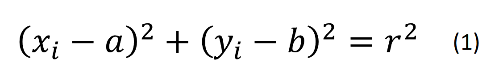
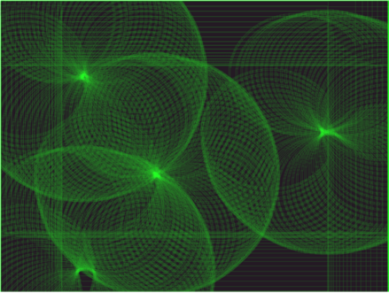

  Object Detection for Swarm Mobile Robots using Computer Vision
 
 Siyang Chen, Sina Sadeghian, Vignesh Selvaraj 
 University of Wisconsin-Madison 
 {schen658, ssadeghian, vselvaraj}@wisc.edu

# Introduction

Mobile robots with the capabilities to carry out fundamental manufacturing operations could havea huge impact in the way parts are produced.  Especially in the cases where conventional manufac-turing is difficult; moreover, mobile robots could collaborate with each other enabling networkedtask sharing and task scheduling .  The new ability makes this type of mobile robot superior compared to AGVs or mobile robots without arms, which leads to an increase in their applications inmodern industry. Obstacle and collision avoidance, object detection and estimating their size, ability to calculatecoordinates of a certain point on the object respect to its edges, ability to detected the center ofthe holes and their diameter are some of the challenges in this approach. To address these challenges, our project is aiming to develope a capable object-detection suite that runs on swarm mobile robots and delivers decent performance given the robots' form factor and hardware. The objects detected here are mostly customed parts, which requires customly trained models for detection. In this case, the models used in this context needs to be easily expandable without loosing detection accuracies.

# Project Settings

## Swarm Robot and Hardware

The swarm robot we used in this project is shown in Figure 1. The robot is consisted with 1 NVIDIA Jetson Nano, 1 motor shield, 2 DC Motors, GPS Modules and 1 Intel Real Sense depth sensing onboard camera in a 10cm x 10cm x 10cm cubic centimeter form factor. The Jetson Nano packs a NVIDIA Maxwell GPU at 472 GFLOPs, paired with an ARM Cortex A-57 MPCore CPU. The total onboard RAM is 4GB. These hardwares gives our onboard micro-comupter liteweight processing capabilities that is a fraction of that in desktop GPUs and CPUs.

 Figure 1: Swarm Robot 

## Target Object

The target object for our studyin setting will be parts in divers forms and shapes, and may or may not have holes on them. The target object selected for our project is shown in Figure 2. This object is a robot part that has un-uniform shapes, sides and holes distributed on its surface. We will train our models in detecting his object in this project.

 Figure 2: Target Object 

# Interfacing with the Device

The device used for this study is a Intel Real sense Depth camera.  The camera outputs data inRGB  and  Depth.   Our  first  task  involved  interfacing  with  the  device.   We  used  ”pyrealsense2”and ”Opencv” to interface with the camera and extract the data.  The data is then packaged asa custom ROS image message as it it easy to interface with the embedded computer installed onthe robot.  The package is then sent to OpenCV for further analysis using the ”CvBridge”.  Theprocess of data acquisition and analysis is shown in Figure 3.

 Figure 3: The communication between ROS package and OpenCV 

# Model Training and Transfer Learning

In this project we performed transfer learning on models to expand the object classes in detection. This transfer learning method reuses a pre-trained model as the starting point to train new models for second tasks. This method is great for our setting to expand detectable class when adding new target objects, resulting in customed models that are capable of detecting new objects when the amount of new objects (classes) we are adding is not too large. To perform transfer learning, the regular steps of training a model is followed including data collection, data processing and data labeling with an additional step to prepare a pre-trained model to reuse. In our project, we selected the Mask R-CNN model as our base model for transfer learning. Our objective is to perform transfer learning on the Mask R-CNN model and expand its detection class to incdlude our customed target object without significant loss in object recognition accuracy.

## Data Collection and Processing

We selected 340 clear, un-blocked images of our target object in different angles, backgrounds and environment lighting as our raw data for transfer learning. These images are of diverse sizes and resolutions, so we performed pre-prosessing of the images to resize all images to 302 x 402 pixels. We then split all images with a 90/10 training/testing set split. These data are then ready to be labeled for our target object.

## Data Labeling

We used tool LabelImg to perform labeling of our processed data images. Every image in this phase is labeled with the target object being selected with a bounding box and given the label name. This will generate an XML file for each image with info describing the label name, locations of the bounding boxes specified by pixels and etc. This labeling process was done for both the traning set and testing set.

## Model Training

For conducting transfer learning on the model, we freeze all intermediate layers (except the last 4 layers for segmentation, bounding box and classification) to keep existing weights on the edges (this is the main idea in transfer learning to 'reuse' much of the model and save time and potentially improve performance). We disable back propagation for the intermediate layers to stop those weights from being changed. We add a new output layer for classification and train our new model with the new processed data. This process is illustrated in Figure 4.

 Figure 4: Transfer Learning Process 

# Object Detection Software Suite

## Workflow
Our project employs a software suite that creates a scaleable realtime-capable object detection pipeline that is suitable for lightweight hardware with limited onboard processing power. This suite is based on Tensorflow's object detection API and supports cumstomable models that could be swapped out conveniently to fit the demand for different object detecion needs and models that are a best fit to the robot onboard hardware. The workflow of the software is shown as below:

 Figure 2: Object Detection Software Suite Workflow 

## Performance Optimization

- Relatively lightweight models (such as SSDLite Mobilenet) were chosen for object detection for better performance on lightweight hardware.
- These models could be swapped accordingly for better hardware available to deliver better performance (such as Faster R-CNN ResNet or EfficientDet etc).
- Capturing frames of a camera-input using OpenCV in separate threads to increase performance
- Have multithreading for the split session for better performance
- Allows models to grow memory allocation

# Circle Hoguh Transform

In a two-dimensional space, a circle can be described by:

where (a,b) is the center of the circle, and r is the radius. If a 2D point (x,y) is fixed, then the parameters can be found according to (1). The parameter space would be three dimensional, (a, b, r). And all the parameters that satisfy (x, y) would lie on the surface of an inverted right-angled cone whose apex is at (x, y, 0). In the 3D space, the circle parameters can be identified by the intersection of many conic surfaces that are defined by points on the 2D circle. This process can be divided into two stages. The first stage is fixing radius then find the optimal center of circles in a 2D parameter space. The second stage is to find the optimal radius in a one dimensional parameter space.

 Figure 3: Center and Radius of circle on x-y axises 

* ## Find parameters with known radius R

If the radius is fixed, then the parameter space would be reduced to 2D (the position of the circle center). For each point (x, y) on the original circle, it can define a circle centered at (x, y) with radius R according to (1). The intersection point of all such circles in the parameter space would be corresponding to the center point of the original circle.

 Figure 4: (x,y) coordinates in 3D space 

* ## Accumulator matrix and voting

In practice, an accumulator matrix is introduced to find the intersection point in the parameter space. First, we need to divide the parameter space into “buckets” using a grid and produce an accumulator matrix according to the grid. The element in the accumulator matrix denotes the number of “circles” in the parameter space that passing through the corresponding grid cell in the parameter space. The number is also called “voting number”. Initially, every element in the matrix is zeros. Then for each “edge” point in the original space, we can formulate a circle in the parameter space and increase the voting number of the grid cell which the circle passes through. This process is called “voting”.
After voting, we can find local maxima in the accumulator matrix. The positions of the local maxima are corresponding to the circle centers in the original space.

 
 Figure 5: Accumulator of many Circles 

# Hole Size Calculation

The primary objective of this task is to calculate the actual size of holes on the part using RGB and depth images. First, the RGB image was aligned on the Depth image using the RealSense library. Later, the Hough Circle detection method was applied on the aligned RGB image. Then, we defined a boundary on each side of the circle and used average distance of each points on the boundary to aligning the camera with the hole. Next, points on the circle achieved using Hough data are shown in Figure x. By utilizing the depth data, converted the points on the RGB image to the cloud points shown in Figure x. Finally, we calculated the average distances of the corresponding points. 

 Figure 3: Cooresponding points on the circle 

 Figure 3: Cloud Points of the RGB and Depth images 

# Results

## Transfer Learning Results

********* Transfer Learning Results **********

## Object Detection Results

The output of our object detection software suite is shown in Figure x below. The pipeline creates a stream of frames at decent frame rate (approximately ~30 fps when using smaller models) without significant lost in classification accuracy. This frame rate makes the object detection useable to keep track of our target object and avoid potential obstacles. The resolution delivered is also fairly well given the harware resources that our software utilizes. The bounding boxes are accurate and has good tracking capabilities with the movements between frames, indicating a stable and well-performed model working in the background. With the performance optimization mechanisms in place this 30 fps peak frame rate is approximately performing ~10x better without opimizations.

 Figure 3: Hough Circle Detection 

## Circle Detection Results

### 1. Hough Circle Detection
The primary objective of this task is to detect the circles in the RGB image, which corresponds to the holes on the object. This is enabled by first converting the RGB image to grey image, followed by applying median blur to remove sharp edges and shiny objects in the image, finally, hough circle detection algorithm with hough gradient is used to identify the circles on the RGB image. The parameters for the hough circles that are detected are determined based on a trial and error method. Since the camera provides a live stream of data at 30fps, the hough algorithm is applied to each individual frame separately. The detected circles are shown in Figure 3

 Figure 3: Hough Circle Detection 

### 2. Circle Actual Size Calculator

Figure x shows the calculated size of holes and their actual values. There is ± 0.1 mm tolerance between actual size of the hole and the predicted one. Therefore, the results look stable with low standard deviation. By tuning the Hough Circle detection parameters, circle detection could be improved, moreover, calibrating the camera would enhance the hole size detection.

 Figure 4: Calculated size of the Hole 

# Discussion & Future work

In this project, we developed a real-time object detection solution optimized for limited hardware that has capabilities in circle detection and circle size measurements. Transfer Learning methods and Hough Transform based detection and calculation methods are the backbone of this project. We reached an acceptable performance for on-board real-time object detection (~30 fps) and achieved accurate results for real-time circle detection and circle size measurements with high precision within ± 0.1mm. From this project, we learned the following things through transfer learning:

- Transfer learning is best applied when the model has been trained on vastly bigger training set than could be acquired for the destination task.
- The model may be prone to overfitting with transfer learning, and data augmentation may not always solve overall problem.

With our current acheivements, we think we could still polish our works in the following ways:

- Polish the area of interest recognition for better stability
- Expand the training and testing dataset for better accuracy
- Fine tune in training parameters

In general, the project had been successful with all parts completed as planned and the performance and results delivered meets our expectation. We wish to keep working on further improvements to make it a more stable, reliable and high-performance real time object detection pipeline solution that applies to ROS and other systems.

# References

[1] X

